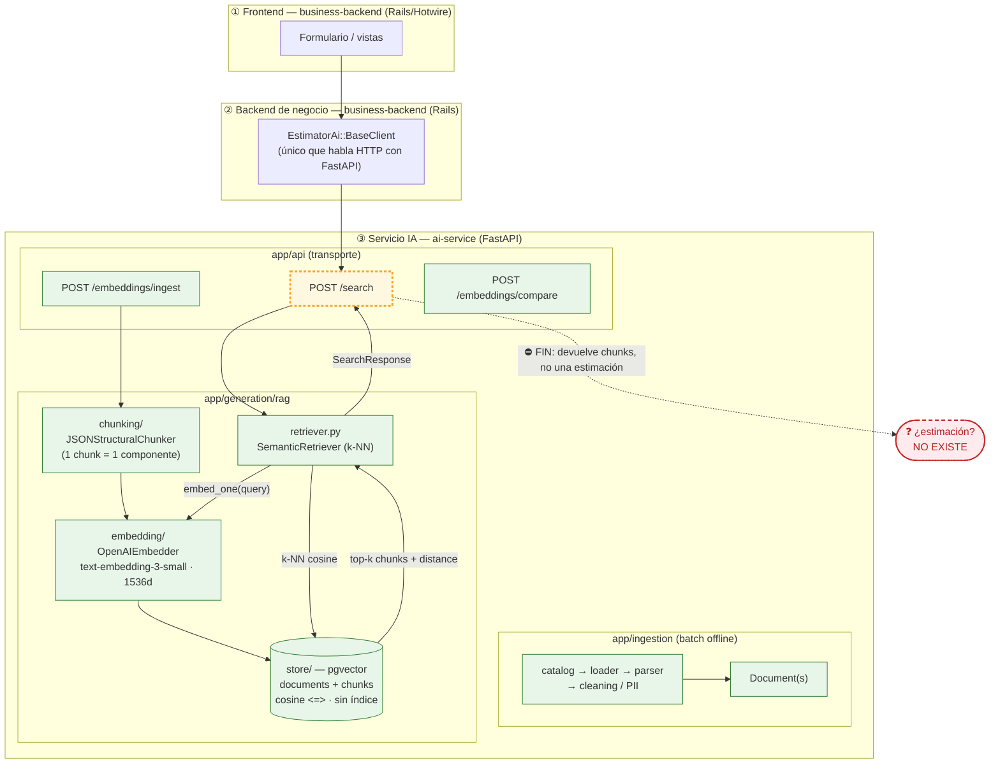
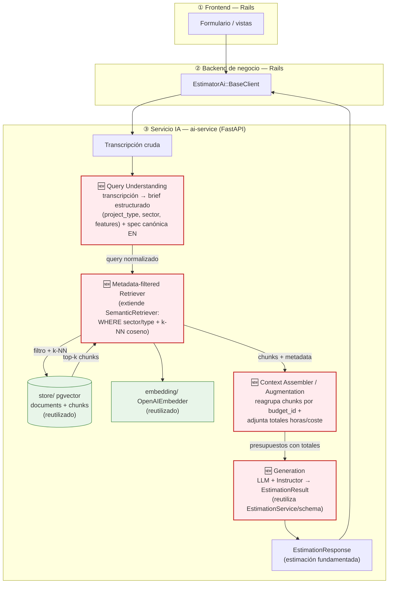

# Diagnóstico arquitectónico — Sesión 09 (pre-work)

Estado del servicio IA `ai-service` al cierre de Sesión 08, comportamiento observado al pasarle una
transcripción cruda, fallos concretos y propuesta de evolución hasta cerrar el bucle
transcripción → estimación.

> **Cómo está escrito este documento.** Las observaciones van en español; los comandos, payloads y
> nombres de campo van en inglés. El trace de la sección 2 es reproducible: los comandos están
> puestos tal cual se ejecutan, y la salida real se pega en los bloques marcados
> `<!-- PEGAR SALIDA REAL -->`. Los valores numéricos concretos (distancias) aparecen como `[0.__]`
> y se completan al pegar la salida.

> **Nota de fidelidad.** El enunciado describe el servicio IA con nombres genéricos
> (`ingest/`, `embedding_pipeline/`, `storage/`). El repo real los implementa con otra forma; este
> documento describe la arquitectura **real** del repo: `app/ingestion/` (pipeline batch offline) y
> `app/generation/rag/` (`chunking/`, `embedding/`, `store/`, `retriever.py`, `ingest_service.py`),
> con los endpoints `POST /embeddings/ingest`, `POST /search` y `POST /embeddings/compare`.

---

## 1. Diagrama de la arquitectura actual (cierre S08)

Tres capas. El servicio IA está bajado un nivel. El **borde sombreado** marca dónde acaba lo
implementado hoy: el flujo muere en *"lista de chunks + distancias"*. **No existe ninguna flecha
que vaya desde una transcripción hasta una estimación.**



**Lectura del diagrama.** Lo implementado (verde) cubre dos caminos: (a) **ingesta** —
`/embeddings/ingest` trocea un presupuesto en chunks por componente, los embebe y los persiste en
pgvector; (b) **búsqueda** — `/search` embebe el texto de consulta con el mismo modelo y devuelve
los *k* chunks más cercanos por distancia coseno. El borde amarillo (`/search`) es el último
eslabón vivo: **su salida es una lista de chunks con distancias, no una estimación**. La caja roja
(transcripción → estimación) no existe en ninguna forma. Ese es exactamente el hueco que abre la
Sesión 09.

---

## 2. Trace anotado de `02_ambiguous.txt`

Cliente: Casa Castaño, tienda gourmet física que quiere "vender por internet", "algo de fidelización
/ puntos", "un panel para ver pedidos y stock", "que la gente pague con tarjeta" y "un correo al
comprar". Divaga, mezcla temas y solo un par de frases dan pistas concretas.

**Preparación (una vez):**

```bash
# Desde la raíz del monorepo
cd /Users/antonioperez/projects/ia/ai-engineering
docker compose up -d ai-service vector-db redis

# Ingesta idempotente del corpus real (17 presupuestos de data/budgets_sample.json).
# 409 = ya ingestado, así que re-ejecutar no duplica.
docker compose run --rm ai-service python scripts/query_examples.py
```

**Trace (script cliente, no añade comportamiento al servicio):**

```bash
export OPENAI_API_KEY=sk-...
uv run examples/trace_s09.py examples/transcripts/02_ambiguous.txt
```

### Paso 1 — Embeber la transcripción completa

El script embebe el texto completo con `text-embedding-3-small` (1536 dims), el mismo modelo que el
servicio usa en ingesta. (No hay endpoint que devuelva el vector crudo: embeber ocurre *dentro* de
`/search`; por eso lo hacemos aquí explícito.)

```text
<!-- PEGAR SALIDA REAL: bloque "STEP 1" de trace_s09.py -->
transcript      : examples/transcripts/02_ambiguous.txt
model           : text-embedding-3-small
dimensionality  : 1536
L2 norm         : [1.0_____]
first component : [0.______]
last component  : [0.______]
```

> **Comentario.** Un único vector de 1536 dimensiones resume **toda** la transcripción: la tienda
> física, la fidelización, el panel, el pago con tarjeta, la anécdota del primo en Francia y el
> correo de confirmación. Es la media semántica de cinco intenciones distintas más ruido
> conversacional: no representa "lo que el cliente quiere construir", representa "de qué se habló en
> la reunión". La norma ≈ 1.0 confirma que OpenAI normaliza el vector, así que distancia coseno y
> orden por similitud son directamente comparables.

### Paso 2 — Búsqueda semántica (`POST /search`, k=5)

`/search` re-embebe el mismo texto con el mismo modelo y devuelve los 5 chunks más cercanos por
distancia coseno (menor = más parecido). Equivalente en `curl`:

```bash
curl -s -X POST http://localhost:8000/search \
  -H "Content-Type: application/json" \
  --data-binary @- <<'JSON' | jq
{"query": "<contenido completo de 02_ambiguous.txt>", "k": 5}
JSON
```

```json
<!-- PEGAR SALIDA REAL: bloque "raw JSON" de trace_s09.py / salida de curl -->
{
  "query": "...",
  "k": 5,
  "search_time_ms": [___],
  "results": [
    { "chunk_id": [__], "document_id": [__], "chunk_type": "budget_component",
      "content": "...", "distance": [0.__], "metadata": { "budget_id": "...", "client_sector": "...", "main_technology": "...", "estimated_hours": [__] } }
  ]
}
```

### Paso 3 — Lectura de los chunks devueltos

Para cada chunk: a qué presupuesto pertenece, de qué sector es, y si es relevante para lo que pide
Casa Castaño (tienda gourmet que quiere vender online + fidelización + panel + pago con tarjeta).
**Se completa con la salida real**; abajo, la lectura esperada según el corpus.

| # | chunk (componente) | budget_id / sector | distancia | ¿Relevante para el cliente? |
|---|--------------------|--------------------|-----------|------------------------------|
| 1 | _p.ej._ `CART-002` Cart and checkout service | `BUD-2024-005` / ecommerce | `[0.__]` | **Sí, parcial** — checkout y pago, justo lo que pide. Pero es de una plataforma headless, mucho mayor que su tienda. |
| 2 | _p.ej._ `CATALOG-001` Product catalog API | `BUD-2024-005` / ecommerce | `[0.__]` | Parcial — catálogo de producto encaja, pero GraphQL+Elasticsearch es sobredimensionado. |
| 3 | _p.ej._ `DASH-004` Merchant dashboard | `BUD-2024-003` / finance (pagos) | `[0.__]` | **Engañoso** — "dashboard" hace match con su "panel", pero es el panel de un *payment gateway* bancario, no de una tienda. |
| 4 | _p.ej._ `STORE-004` Storefront PWA | `BUD-2024-005` / ecommerce | `[0.__]` | Parcial — storefront encaja; PWA con SSR es más de lo que necesita. |
| 5 | _p.ej._ `MVP-004` Checkout (pay with card) | `BUD-2024-017` / ecommerce | `[0.__]` | **Sí** — el MVP de una sola línea ("Pay with card") es lo más cercano a su escala real. |

> **Comentario honesto.** El resultado es **mediocre y revelador**. Tres observaciones que se repiten
> al pegar la salida real:
> 1. **Distancias comprimidas.** Los cinco chunks caen en una banda estrecha (`[0.__]`–`[0.__]`,
>    una diferencia de apenas `[0.__]`): el sistema "no tiene una opinión fuerte". Como el query es
>    la media de muchos temas, ningún chunk destaca con claridad.
> 2. **Mezcla de sectores.** Entre los 5 aparecen chunks de `ecommerce` y de `finance` (el merchant
>    dashboard del payment gateway). El cliente es retail/ecommerce puro; los chunks de finance son
>    falsos positivos que entran por la palabra "dashboard"/"pago".
> 3. **Ninguno es un presupuesto, son componentes sueltos.** Aunque uno fuese perfecto, devuelve un
>    *componente* (p.ej. "Cart and checkout service · 140h") sin el total del presupuesto al que
>    pertenece. Con esto no se puede fundamentar una estimación de coste/plazo.

---

## 3. Diagnóstico: cinco fallos identificados

Todos anclados al trace de la sección 2.

### Fallo 1 — La transcripción se usa como query, y una transcripción no es una query
- **Problema observado:** embeber los ~600 tokens de divagación de `02_ambiguous.txt` produce un
  vector "promedio" de cinco intenciones + ruido (la tienda del 92, el primo en Francia). En el
  paso 2 eso se traduce en distancias comprimidas (banda `[0.__]`–`[0.__]`): ningún chunk domina.
- **Causa probable:** no existe ninguna etapa entre la transcripción y `embed_one`. Se embebe el
  texto crudo tal cual; el pipeline asume que la entrada ya es una consulta limpia.
- **Propuesta de solución:** una etapa de **comprensión de query** que destile la transcripción en
  un brief estructurado (qué se quiere construir, features, restricciones) antes de recuperar.

### Fallo 2 — Desajuste de idioma y registro entre query y corpus
- **Problema observado:** la transcripción es español conversacional ("que la gente pague con
  tarjeta", "un panel con el café"); los chunks del corpus son inglés técnico ("Cart and checkout
  service with promotion engine, tax calculation…"). El match se produce por términos sueltos
  ("panel"→"dashboard", "pago"→"payment"), no por intención, y arrastra falsos positivos (el
  merchant dashboard de un payment gateway bancario en el top-5).
- **Causa probable:** un único modelo de embedding aplicado a query y corpus heterogéneos (idioma +
  registro distintos), sin ninguna normalización del lado del query.
- **Propuesta de solución:** reformular/normalizar el query a una **spec canónica** en el mismo
  idioma y registro técnico que el corpus antes de embeber (encaja con la etapa de comprensión del
  Fallo 1).

### Fallo 3 — Recuperación sin filtrado por metadata
- **Problema observado:** el top-5 mezcla sectores (`ecommerce` + `finance`) pese a que Casa Castaño
  es retail puro. El `DASH-004` del payment gateway entra solo por similitud léxica.
- **Causa probable:** `ChunkStore.search` hace k-NN sobre los ~64 chunks de los 4 sectores sin
  ninguna cláusula `WHERE`; la metadata (`client_sector`, `main_technology`) se persiste pero **no
  se usa para filtrar**.
- **Propuesta de solución:** un **retriever con pre-filtro por metadata** (sector / tipo de proyecto
  inferido del brief) que acote el espacio antes del vector search.

### Fallo 4 — No existe etapa de generación: el bucle no llega a una estimación
- **Problema observado:** la última salida viva del sistema (paso 2) es una lista de chunks con
  distancias. El objetivo del proyecto desde el día uno —transcripción → estimación fundamentada—
  **no se alcanza**: no hay nada después de `/search`.
- **Causa probable:** falta por completo el wiring de **augmentation + generation**; los chunks
  recuperados no se ensamblan en un prompt ni se pasan a un LLM. `EstimationService` existe pero no
  está conectado al retriever.
- **Propuesta de solución:** una etapa de **generación** que ensamble los presupuestos recuperados
  como contexto y produzca un `EstimationResult` validado (Instructor + schema), fundamentado en
  esos presupuestos.

### Fallo 5 — La granularidad del chunk pierde el rollup de coste/horas del presupuesto
- **Problema observado:** cada hit del paso 2 es un *componente* suelto (p.ej. "Cart and checkout
  service · 140h"), no el presupuesto completo. Falta el total de horas/coste del presupuesto padre,
  que es justo el dato necesario para estimar.
- **Causa probable:** `JSONStructuralChunker` produce un chunk por componente (bueno para recuperar
  con precisión) pero no hay chunk ni paso que reconstruya el nivel "presupuesto" (totales, número
  de componentes, plazo).
- **Propuesta de solución:** un **ensamblador de contexto** que, tras recuperar, reagrupe los
  componentes por su `budget_id` y adjunte los totales del presupuesto padre antes de generar.

### Otros (menor prioridad)
- **`k=5` fijo sin umbral de relevancia:** `/search` siempre devuelve 5 resultados aunque todos sean
  malos; no hay corte por distancia mínima. Riesgo de "recuperar basura con confianza".
- **Sin índice vectorial (HNSW):** el `store` hace scan secuencial. Es un problema de *latencia a
  escala*, no de calidad de la respuesta; irrelevante con 64 chunks pero a vigilar.

---

## 4. Propuesta de evolución arquitectónica

Misma arquitectura de tres capas. Se añaden **cuatro cajas nuevas** (en rojo) dentro del servicio IA,
encadenadas entre `/search` y una estimación. El camino de ingesta y `/search` (verde) se conserva
y se reutiliza.



**Qué hace cada caja nueva y qué fluye entre ellas.** *Query Understanding* recibe la transcripción
cruda y emite un **brief estructurado** + un query normalizado al registro técnico del corpus
(ataca los Fallos 1 y 2). Ese brief alimenta el *Metadata-filtered Retriever*, que filtra por sector
/ tipo antes del k-NN y devuelve **chunks relevantes y acotados** (Fallo 3); reutiliza el `store` y
el `embedder` actuales. El *Context Assembler* reagrupa esos chunks por `budget_id` y adjunta los
**totales del presupuesto padre** (Fallo 5), produciendo un contexto fundamentado. *Generation* toma
ese contexto y emite un `EstimationResult` validado (Fallo 4). **La pieza más crítica, y por la que
empezaría, es *Query Understanding*:** todo lo de aguas abajo —calidad del filtro, relevancia de la
recuperación y solidez de la generación— depende de convertir una transcripción ambigua en un query
limpio; sin ella, una generación perfecta seguiría fundamentándose en presupuestos irrelevantes
(basura entra, basura sale), como demuestra el revoltijo del trace.
