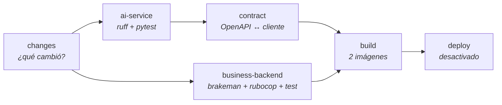
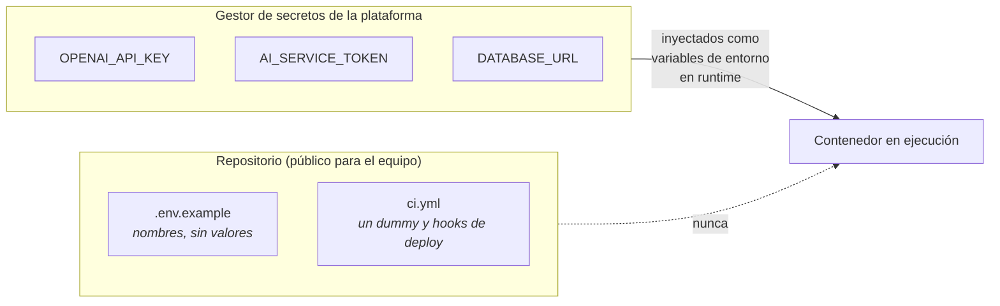

# CI/CD — el proceso de despliegue

Sesión 15 · Módulo 6

Antes de esta sesión el repositorio **no tenía CI**. Había un `ci.yml` dentro de
`business-backend/.github/`, pero GitHub Actions solo lee
`.github/workflows/` **de la raíz del repositorio**: ese fichero nunca se
ejecutó ni una vez. Y aunque se hubiera ejecutado, solo cubría Rails.

El pipeline vive ahora en `.github/workflows/ci.yml` y cubre los dos proyectos.

---

## Las cuatro etapas

Se construye por capas, y cada una responde una pregunta distinta. Las versiones
intermedias están en `.github/ci-steps/` (fuera de `workflows/` para que no se
ejecuten) por si quieres reproducir el recorrido.

| # | Etapa | Pregunta | Fichero |
|---|---|---|---|
| 1 | Tests del servicio IA | ¿El código funciona? | `ci-steps/step-1-test.yml` |
| 2 | + Rails y filtros de path | ¿Y el otro proyecto, sin reconstruirlo todo? | `ci-steps/step-2-both-projects.yml` |
| 3 | + Contract test | ¿Siguen entendiéndose las dos capas? | `ci-steps/step-3-contract.yml` |
| 4 | + Build de imágenes y hueco de CD | ¿Esto además se puede desplegar? | `ci-steps/step-4-build.yml` |



---

## Regla 1 — en CI no se llama al modelo

**Ninguna prueba del pipeline habla con OpenAI ni con Anthropic.** No es por
ahorrar unos céntimos:

- **Determinismo.** El mismo commit debe dar el mismo resultado. Un modelo
  generativo no lo garantiza, así que el pipeline empezaría a fallar por razones
  que no tienen nada que ver con el cambio.
- **Velocidad.** Una llamada real son segundos; 600 tests serían horas.
- **Rate limits.** Diez pull requests a la vez agotarían la cuota y la culpa
  parecería del código.
- **Coste.** Multiplicado por cada push, de cada persona, cada día.

Cómo se sustituye el modelo en cada suite:

| Doble | Dónde | Qué reemplaza |
|---|---|---|
| `FakeLLMWrapper` | `ai-service/tests/conftest.py` | `complete_structured_chat`, con respuestas guionizadas |
| Monkeypatch de módulo | `tests/api/*` | `retrieve`, `estimate_from_transcript`, `reformulate_query` |
| `AsyncOpenAI` falso | `tests/generation/agentic/` | La Responses API del agente S12 |
| `fakeredis` | 5 módulos | Redis |
| WebMock | `business-backend/test/` | **Todo** el servicio IA |

La única clave del pipeline es `OPENAI_API_KEY: sk-test-not-a-real-key`, un dummy
sintácticamente válido. Existe porque `app/config.py` se niega a construir
`Settings` sin clave de proveedor, así que sin ella ni siquiera se pueden
recolectar los tests.

> **Evaluar la CALIDAD del modelo sí requiere llamarlo** — y por eso es un job
> distinto, con otra cadencia. Eso es la Sesión 16.

---

## Regla 2 — los secretos nunca entran al repositorio ni a los logs



Tres reglas concretas:

1. **Nada de secretos en la imagen.** Se inyectan en runtime. Una imagen con una
   clave dentro filtra esa clave a cualquiera que pueda descargarla.
2. **Nada de secretos en el pipeline** más allá de los deploy hooks. Las claves de
   aplicación viven en `/opt/estimator/.env` **en la instancia**, con permisos 600, y no
   pasan por GitHub.
3. **Nada de secretos en los logs.** Nunca hagas `echo` de una variable. Para
   comparar dos valores, compara sus hashes:
   `printenv AI_SERVICE_TOKEN | sha256sum`.

GitHub enmascara los valores de `secrets.*` en los logs, pero eso es una red de
seguridad, no una política: no protege de un `curl -v` que imprima cabeceras.

---

## Regla 3 — reconstruir solo lo que cambió

En un monorepo esto es la diferencia entre 2 y 20 minutos. El job `changes` usa
`dorny/paths-filter` una vez y el resto de jobs son condicionales.

Una trampa concreta: **GitHub omite un job cuyo `needs` fue omitido.** El job
`contract` depende de `ai-service`, que se omite en un cambio solo-Rails —
justo cuando el contrato más necesita comprobarse. Por eso su condición empieza
con `always()`:

```yaml
if: >-
  always() && !contains(needs.*.result, 'failure') && !cancelled() &&
  (needs.changes.outputs.ai-service == 'true' || needs.changes.outputs.business-backend == 'true')
```

---

## El contract test

El job que solo necesita un repo multi-servicio. Las dos suites pueden estar
verdes mientras las capas se han separado: renombras un endpoint en el servicio
IA, sus tests siguen pasando, y el cliente Rails se lleva un 404 en producción.

`ai-service/scripts/check_contract.py` importa la app FastAPI, genera el OpenAPI
desde los mismos modelos Pydantic que sirven el tráfico, y lo compara con
`docs/contract/business-backend-consumed-routes.json` — las 30 rutas que llaman
los clientes Ruby. Sin servidor y sin red.

También comprueba que `/health` y `/health/ready` **siguen exentos** del token:
si dejaran de estarlo, ningún contenedor volvería a reportarse sano.

```bash
cd ai-service && uv run python scripts/check_contract.py
# Contract OK -- 32 checks passed (30 consumed routes).
```

---

## Por qué CI necesita un Postgres

Cinco módulos de test entran en el `lifespan` de FastAPI, que abre un pool de
conexiones para el checkpointer de LangGraph. Sin un Postgres real, cada uno se
bloquea en el timeout del pool antes de que el error se trague: los tests
**pasan igual**, solo que tardan minutos. Un service container desechable es más
barato que la espera.

No hace falta Redis: la suite lo dobla con `fakeredis`.

El efecto es medible y vale la pena conocerlo: con el compose **estricto** (que no publica el
5433) la suite completa tarda **~9 minutos** en local; con un Postgres alcanzable, **~20 segundos**.
Los mismos 601 tests, el mismo resultado.

---

## Una lección que salió al montar esto

Siete tests fallaban en local y pasaban en CI. La causa: el plugin de `deepeval`
llama a `load_dotenv()` al cargarse, lo que vuelca el `.env` del desarrollador en
`os.environ` **antes de que corra el primer test**. Con `PRIMARY_MODEL=gpt-4o` en
un `.env` local, siete tests que asertan el valor por defecto fallaban con
`'gpt-4o' == 'gpt-4o-mini'`. En CI no hay `.env`, así que allí pasaban.

Un entorno de test que depende de la máquina no es un entorno de test. El
fixture `_hermetic_environment` de `ai-service/tests/conftest.py` limpia esas
variables, y ahora local y CI dan el mismo resultado. **Es el mismo principio
de doce factores que rige el despliegue, aplicado a los tests.**

---

## CD — preparado y desactivado

El job `deploy` está escrito y cableado, pero apagado con `&& false`. Para
activarlo: quitar ese `&& false` y crear los secretos
`EC2_HOST`, `EC2_USER` y `EC2_SSH_KEY`, y definir la variable `APP_DOMAIN`.

Orden importante: **primero el servicio IA, después el backend de negocio**. El
segundo depende del primero.

El smoke test corre **después** del despliegue, contra el entorno desplegado,
nunca dentro de CI — es el único que sí llama al modelo real, y por eso no puede
bloquear un commit cualquiera.

---

## Ganchos para la Sesión 16

Al final de `ci.yml` hay tres jobs comentados con el marcador `TODO(S16)`:

| Job | Qué hará | Cadencia |
|---|---|---|
| `evaluate-golden-set` | Correr el golden set contra el modelo real | Nocturna / bajo demanda |
| `regression-gate` | Comparar con la línea base y fallar si la calidad cae | Tras la evaluación |
| `ab-test` | Dos versiones de prompt sobre el mismo golden set | Bajo demanda |

Van separados de los jobs de arriba **precisamente porque llaman al modelo**: son
lentos, cuestan dinero y no son deterministas. Convertirlos en un gate de cada
commit reproduciría todos los problemas que la regla 1 evita.
